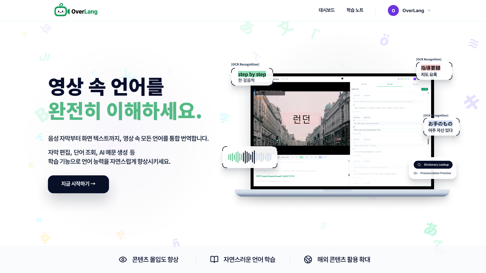
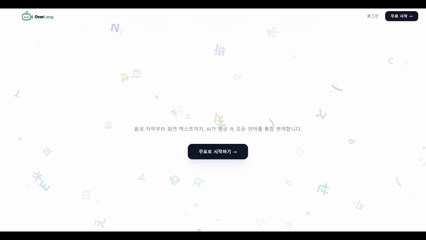
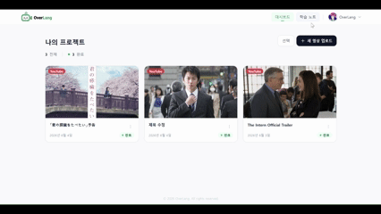
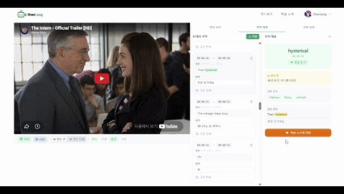
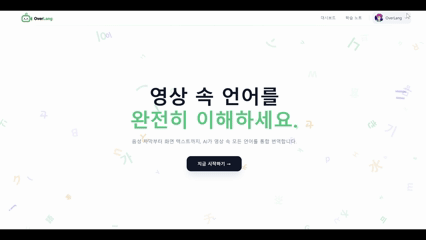
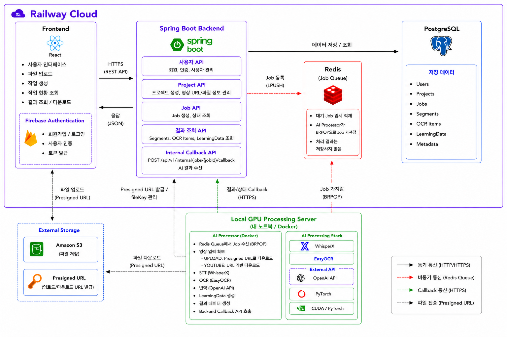

# OverLang
> 영상 속 정보의 공백을 해소하고, 시청 경험을 학습으로 연결하는 **AI 기반 영상 번역 및 학습** 웹 플랫폼입니다.

## 🚀 Key Features
- 🎙️ 영상 속 음성을 자막으로 변환하고 다국어 번역 제공
- 📝 영상 화면의 텍스트(PPT, 간판, 자막 등)를 추출하여 번역 제공
- 🔗 음성 정보와 화면 텍스트를 함께 분석하여 보다 완전한 영상 이해 지원
- 📚 핵심 단어, 주요 표현, 영상 요약 등 학습 콘텐츠 자동 생성
- 💡 문맥 기반 단어 설명 및 표현 학습 기능 제공
- ⚡ Redis Queue 기반 비동기 AI 영상 분석 처리

## 💡 Why OverLang?

### 1. 음성과 화면 텍스트를 함께 분석
기존 영상 번역 서비스는 주로 음성(STT) 기반 자막 생성에 집중하기 때문에, 화면에 등장하는 PPT, 간판, 자막, UI 텍스트 등은 충분히 활용되지 못하는 경우가 있습니다. OverLang은 STT와 OCR을 함께 활용하여 영상 속 음성과 화면 텍스트를 통합적으로 분석합니다.

### 2. 번역을 넘어 학습 콘텐츠로 확장
OverLang은 단순히 번역 결과만 제공하지 않고, 영상 내용을 기반으로 핵심 단어, 주요 표현, 요약 등 학습 콘텐츠를 생성합니다. 이를 통해 사용자는 영상을 시청하는 과정에서 자연스럽게 외국어 학습까지 이어갈 수 있습니다.

### 3. 실제 서비스 흐름을 고려한 구조
영상 분석은 시간이 오래 걸릴 수 있기 때문에 Redis Queue 기반 비동기 처리 구조를 적용했습니다. Frontend, Backend, AI Server를 분리하여 AI 분석 작업을 독립적으로 처리하고, 향후 OCR 품질 개선이나 학습 기능 확장에도 유연하게 대응할 수 있도록 설계했습니다.

## 🖥️ Service Preview
<table>
  <tr>
    <td align="center">
      
    </td>
    <td align="center">
      
    </td>
    <td align="center">
      
    </td>
  </tr>

  <tr>
    <td align="center"><b>메인 페이지</b></td>
    <td align="center"><b>업로드 페이지</b></td>
    <td align="center"><b>대시보드</b></td>
  </tr>

  <tr>
    <td align="center">
      
    </td>
    <td align="center">
      
    </td>
    <td align="center">
      
    </td>
  </tr>

  <tr>
    <td align="center"><b>번역 & 학습 페이지</b></td>
    <td align="center"><b>학습 노트</b></td>
    <td align="center"><b>마이페이지</b></td>
  </tr>
</table>

## 🏗️ System Architecture

## 🛠️ Tech Stack
#### Frontend

#### Backend

#### AI/LLM

#### Database

#### Infrastructure & Deployment

## 👥 Team
<table>
  <tr>
    <td align="center">
      
    </td>
    <td align="center">
      
    </td>
    <td align="center">
      
    </td>
  </tr>

  <tr>
    <td align="center"><b>Frontend</b></td>
    <td align="center"><b>Backend</b></td>
    <td align="center"><b>AI</b></td>
  </tr>

  <tr>
    <td align="center">이지원</td>
    <td align="center">한국희</td>
    <td align="center">서유정</td>
  </tr>
</table>
